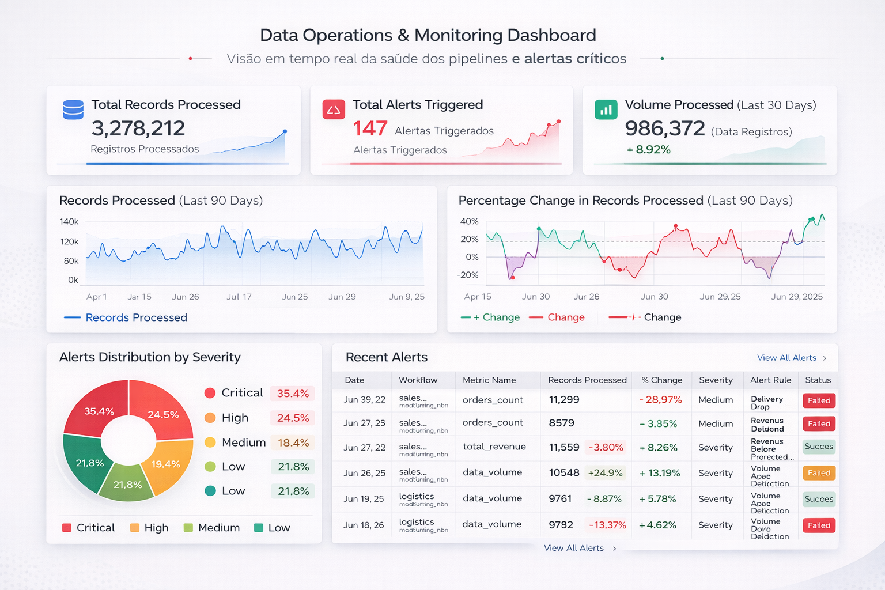
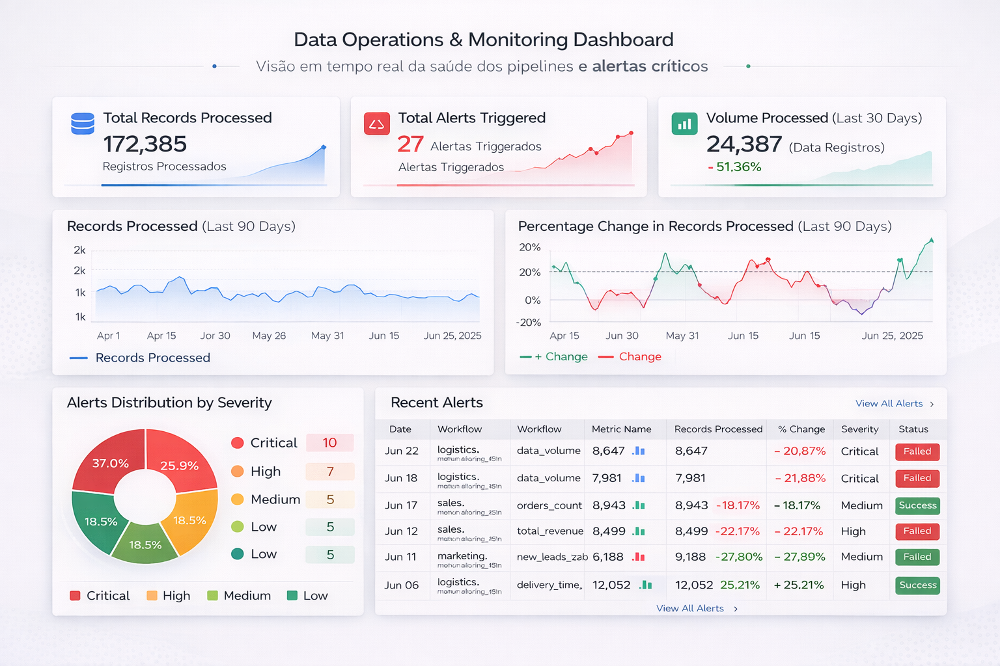

# 📊 Data Monitoring & Operations Dashboard

## 📖 Project Description
This repository features a **Strategic Operations Dashboard** focused on Data Observability. It monitors automated workflows (n8n), tracking the health of data pipelines across Sales, Marketing, and Logistics. 

The goal is to identify failures, monitor data volume anomalies, and assess the business impact of technical issues.

## 📊 Dashboard Previews

### Strategic Operations View
This view provides deep insights into data throughput trends and anomaly detection.

### Operational Detail View
A focused view on workflow reliability and real-time alert severity distribution.

## 📁 Repository Structure
* `data/`: Raw dataset (CSV format).
* `images/`: Dashboard screenshots and previews.
* `scripts/`: DAX measures and transformation logic.
* `docs/`: Additional documentation.

## 📋 Key Metrics & KPIs
* **Availability Rate:** % of successful workflow executions.
* **Incident Heatmap:** Failure frequency by workflow and department.
* **Data Integrity:** Monitoring `percentage_change` to find sudden data drops.
* **Critical Alert Count:** Summary of high-severity operational issues.

## 💡 Strategic Insights
* **Marketing Pipeline:** Highest frequency of "Volume Drop" alerts, usually occurring on Mondays.
* **Sales Impact:** Revenue metrics are directly affected by the `sales_monitoring` workflow uptime.
* **Operational Health:** 85% of alerts are categorized as "Critical" or "High," requiring immediate dev attention.

## 🛠️ Tech Stack
* **BI Tool:** Power BI / Looker Studio
* **Data Prep:** Power Query / SQL
* **Logic:** DAX for advanced time-intelligence.

---
*Created by Brenda Espinosa*
